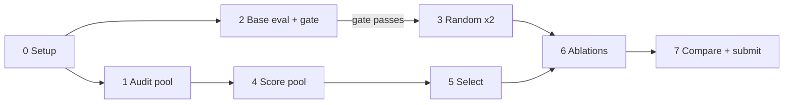

# Reasoning SFT data selection: home

**Question:** we fine-tune Qwen2.5-3B-Instruct on 15K samples drawn from a fixed 100K pool of AceReason-1.1-SFT
(R1-distilled math and code). Does a *smart* 15K subset beat a *random* 15K subset, at identical
hyperparameters, by more than seed noise?

**Deadline:** **Oct 20, 2026** (the course README says Oct 14; Manas confirmed Oct 20 on 2026-10-05). No late submissions.

> [!IMPORTANT]
> **Where are we right now?** See **[STATUS](STATUS.md)**. It is the single source of truth for the current
> step, running jobs, next actions and blockers. Humans and agents update it after every change.

## The seven steps

| # | Step | What happens |
|---|---|---|
| 0 | [Setup](steps/00-setup.md) | envs, data, dev set on ARC |
| 1 | [Audit the pool](steps/01-audit-pool.md) | measure every sample: domain, length, truncation, answer, duplicates, contamination |
| 2 | [Base model eval](steps/02-base-eval.md) | eval untrained Qwen-3B on 8 benchmarks; **gate**: the eval environment must reproduce last year's baseline |
| 3 | [Random baselines](steps/03-random-baselines.md) | train two random 15K subsets: the noise floor |
| 4 | [Score the pool](steps/04-score-pool.md) | pass rate (difficulty), R1 agreement (label noise), topic clusters. Critical path. |
| 5 | [Design the selection](steps/05-selection.md) | filters + difficulty band + cluster stratification → exactly 15,000 |
| 6 | [Ablations](steps/06-ablations.md) | train each selection variant with the same frozen setup |
| 7 | [Compare and submit](steps/07-compare-submit.md) | noise-aware results table, HF uploads, report |

## Reference

- [Decision log](reference/decision-log.md): every deliberate choice, dated, with reasons
- [Upstream compliance](reference/upstream-compliance.md): where and why we differ from the course README
- [ARC guide and gotchas](reference/arc-guide.md): account, partitions, disk, environment traps already solved
- [Eval facts](reference/eval-facts.md): benchmarks, metrics, noise levels, last year's numbers
- [Repo map](reference/repo-map.md): what every folder and script does
- [Runs](runs/README.md): one note per training run (from the [run template](templates/run.md))

## Generated outputs (written by scripts; do not edit by hand)

- [Pool audit](../analysis/pool_audit.md): Step 1
- [Cluster spot-check](../analysis/clusters_spotcheck.md): Step 4
- [Test results](../results/results.md) and [dev results](../results/dev_results.md): Steps 2, 3, 6, 7

(These links stay dead until the step that produces the file has run.)

## Ground rules (full list in [CLAUDE.md](../CLAUDE.md))

- `eval/` is never modified. The 8 test benchmarks are never used to choose data, checkpoints or hyperparameters;
  use the dev set.
- Comparison runs differ **only in data**: same YAML, same 8-GPU setup.
- The course README's steps win over our own preferences. Deviations are listed in
  [Upstream compliance](reference/upstream-compliance.md).
- A gap smaller than the random seed spread is **not** an improvement.
